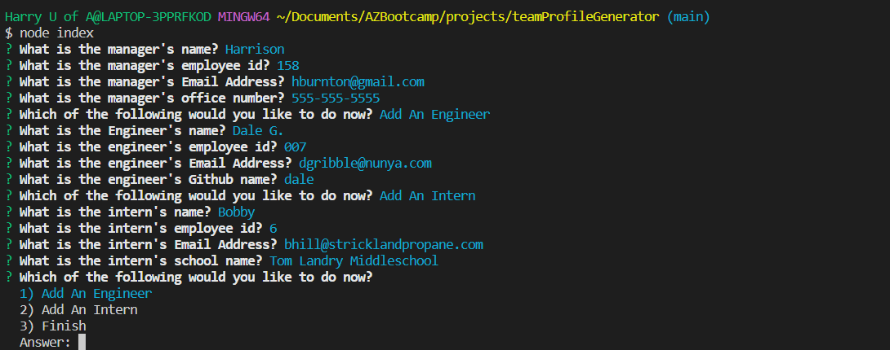

[](https://opensource.org/licenses/MIT)
# Team Profile Generator


## Description
This is a team profile generator that runs from the command line using inquirer. It creates users based on class roles and creates an html page that is dynamically generated and styled using bootstrap. This makes adding your team to your website easier just by answering a few questions. Challenges faced while making this include utilizing inquirer, dynamic generation of content, and using/extending classes. Testing also was a new concept and was fun to learn using Jest.

### Table of contents
- [Description](#description)
- [Installation Instructions](#installation-instructions)
- [Usage Guidelines](#usage-guidelines)
- [Testing Information](#testing-information)
- [Contact](#contact)

## Installation Instructions
To install, download the repo, 
```npm install``` 
to download jest and inquirer and run using ```node index```

## Usage Guidelines
When first being run, the application will ask for manager information including Name, ID, Email, and office number. There is simple validation to ensure something is entered. After user will be prompted to choose to enter either an engineer, and intern or to finish. Adding Engineer or Intern will prompt further questions. When user selects finish a new html page will be generated in the dist folder. Please see video and screenshots below.
* ### Video Demo
The following link directs to a youtube video showing how project works
[Video Demo](https://www.youtube.com/watch?v=cgfZdq2of7Q)

* ### Screenshots




* ### Built Page
[Click Here For A Demo Of a Generate Page](https://github.com/HBurnton/teamProfileGenerator/blob/main/dist/index.html)

## Testing Information
Test files are provided to test classes. Download, ```npm install``` to use jest and run test using ```npm test```

## Questions? Contact me
[Find me on GitHub](https://github.com/hburnton)

[Send me an email](mailto:hburnton@gmail.com)

## License
This project licensed under the MIT license.
[Details on the MIT license](https://choosealicense.com/licenses/mit/)
